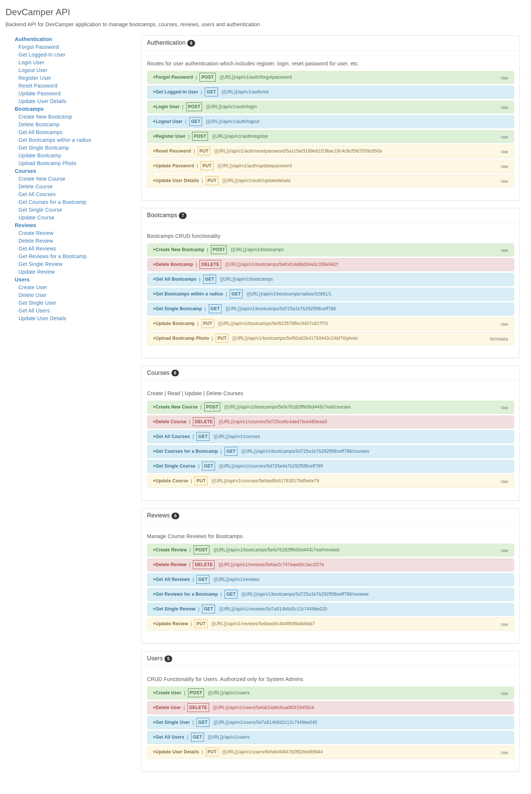

# DevCamper API

> Backend API for DevCamper Application which is a bootcamp directory website.

## API Documentation Screenshots

List of APIs Provided



```
Replace {{URL}} with your Port In Postman
eg: {{URL}} = http://localhost:5000
```

## Usage

Rename "config/config.env.env" to "config/config.env" and update the blank values/settings to your custom values.

## Install Dependencies

```
sudo npm install
```

## Run App

```
# Run in Dev Mode
sudo npm run dev

# Run in Production Mode
sudo npm start
```

## Course Details

> Node.js API Masterclass With Express & MongoDB

> Link: https://www.udemy.com/course/nodejs-api-masterclass/

```
Special Thanks to Brad Traversy For Such a Wonderful API Course
```

- Version: 1.0.0

- License: ISC
